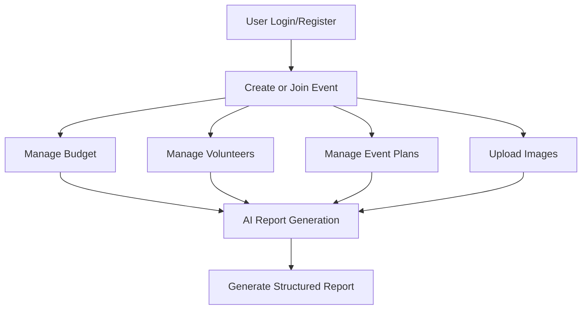
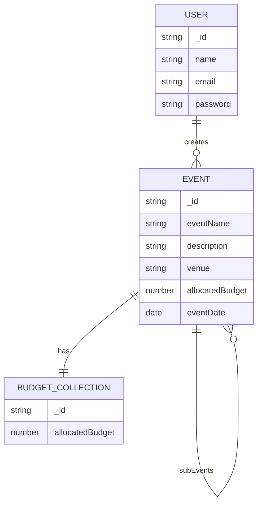
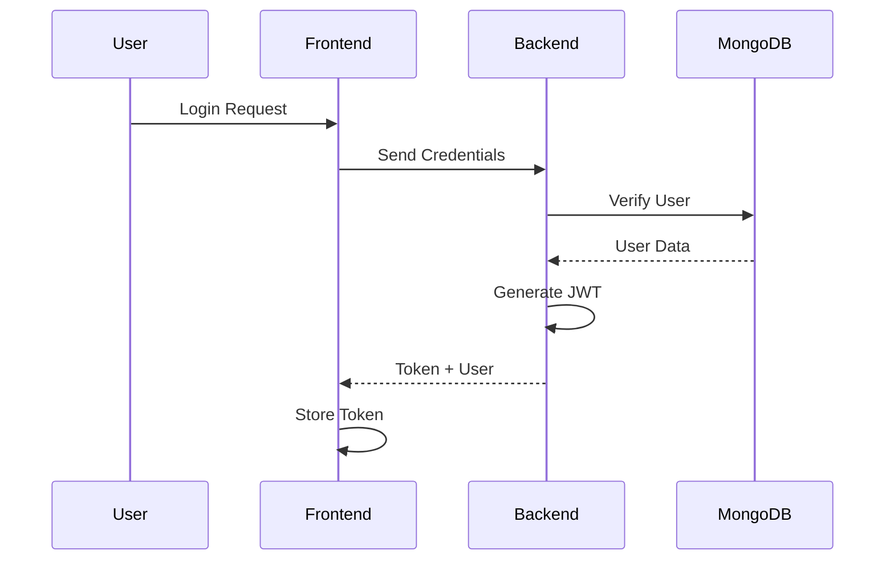

# 🚀 IntelliVent

### 🧠 AI-Powered Event Management & Report Generation Platform


---

## 📌 Overview

**IntelliVent** is a full-stack AI-powered event management platform designed to simplify the planning, organization, and documentation of events.

The platform enables users to:

- Create and manage events
- Organize sub-events
- Track budgets and expenses
- Manage volunteers
- Upload event images
- Generate AI-powered event reports

IntelliVent is built for **colleges, clubs, organizations, and teams** that want a modern system for collaborative event handling and automated documentation.

---

# ✨ Features

## 🎯 Event Management

- Create and manage events
- Nested sub-event support
- Event sharing via unique Event ID
- Collaborative access system

## 👥 Volunteer Management

- Add single or multiple volunteers
- Track volunteer roles and departments

## 💰 Budget Management

- Manage allocated budgets
- Add and track expenses
- Live remaining budget calculation

## 📝 Event Planning

- Add and edit event plans
- Structured heading-based planning system

## 🖼️ Image Management

- Upload event images
- Drag-and-drop image support
- Event gallery management

## 🤖 AI Integration

Generate:
- Event Overview
- Event Conclusion
- Full Event Report

Powered using **OpenRouter AI APIs**

## 🔐 Authentication System

- JWT-based authentication
- Secure password hashing using bcrypt
- Protected routes and authorization middleware

## 🎨 Modern UI/UX

- Fully responsive design
- Dark themed dashboard
- Skeleton loaders and smooth transitions
- Optimized for desktop and mobile

---

# ⚙️ Tech Stack

| Category | Technology |
|---|---|
| Frontend | React.js, Tailwind CSS |
| Backend | Node.js, Express.js |
| Database | MongoDB |
| Authentication | JWT, bcrypt |
| AI Integration | OpenRouter API |
| Deployment | Vercel |

---

# 🏗️ Project Structure

```bash
IntelliVent/
│
├── frontend/
│   ├── components/
│   ├── pages/
│   ├── services/
│   └── assets/
│
├── backend/
│   ├── config/
│   ├── controllers/
│   ├── middleware/
│   ├── models/
│   ├── routes/
│   └── utils/
│
└── README.md
```

---

## 🚀 Getting Started

### 1️⃣ Clone Repository

```bash
git clone https://github.com/piyush112007/intellivent.git
cd intellivent
```

### 2️⃣ Install Dependencies

#### Frontend

```bash
cd frontend
npm install
npm run dev
```

#### Backend

```bash
cd backend
npm install
npm start
```

---

## 🔑 Environment Variables

Create a `.env` file inside backend:

```env
MONGO_URI=your_mongodb_connection_string

JWT_SECRET=your_jwt_secret

OPENROUTER_API_KEY=your_openrouter_api_key
```

---

## 🔄 Workflow



---
## DataBase Structure

---
## 🔐 Authentication Flow

---
## 🚫 Limitations

* No PPT generation
* Limited report customization
* AI output depends on input quality

---

## 🔮 Future Scope

* 📊 PPT generation
* 📱 Mobile application
* 📈 Analytics dashboard
* 🎨 Custom templates
* 🤝 Real-time collaboration
* ☁️ Cloud media storage
* 🧠 Multi-model AI support
---

## 👨‍💻 Team Members

* Janhavi Mishra  – Frontend Developer(https://github.com/Janhavi2126)
* Piyushkumar Singh  – Backend Developer
* Yash Verma  – AI Integration


---


## 🤝 Contribution

Contributions are welcome!
1. Fork the repository
2. Create a feature branch
3. Commit changes
4. Open a Pull Request


## ⭐ Support

If you like this project, give it a ⭐ on GitHub!

---

