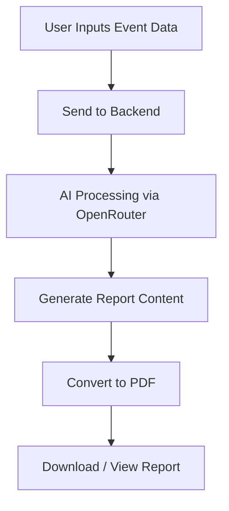
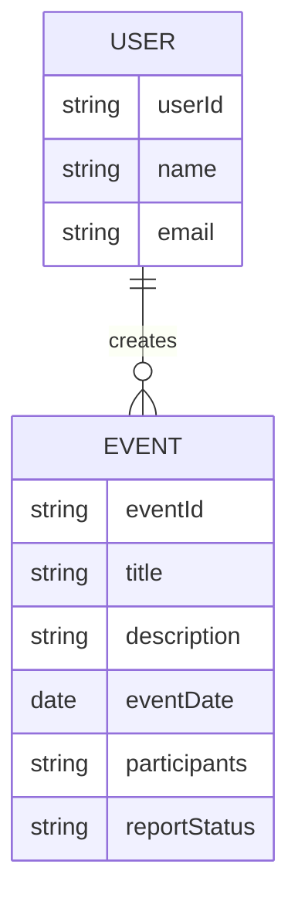

# 🚀 IntelliVent

### 🧠 AI-Powered Event Report Generator


---

## 📌 Overview

**IntelliVent** is an AI-powered web application that automates the creation of professional event reports.
It transforms raw event data into structured, well-formatted reports including **overview, conclusion, and complete documentation**.

Designed for **colleges, clubs, and organizations**, IntelliVent reduces manual effort and ensures consistency in reporting.

---

## ✨ Key Features

### 🤖 AI Report Generation

* Generate **event overview**, **conclusion**, or **full report**
* Uses advanced AI models via OpenRouter

### 📄 PDF Export

* Instantly download structured reports in PDF format

### 👥 Project Collaboration

* Create projects with unique codes
* Share and manage reports within a team

### 🎨 Modern UI

* Responsive and clean interface
* Built for simplicity and usability

---

## ⚙️ Tech Stack

| Category       | Technology                        |
| -------------- | --------------------------------- |
| Frontend       | React.js, Tailwind CSS            |
| Backend        | Node.js, Express.js               |
| Database       | MongoDB                           |
| AI Integration | OpenRouter  |

---

## 🏗️ Project Structure

```bash
IntelliVent/
│── frontend/
│   ├── components/
│   ├── pages/
│   └── services/
│
│── backend/
│   ├── routes/
│   ├── models/
│   ├── controllers/
│   └── middleware/
│
│── README.md
```

---

## 🚀 Getting Started

### 1️⃣ Clone Repository

```bash
git clone https://github.com/piyush112007/intellivent.git
cd intellivent
```

### 2️⃣ Install Dependencies

#### Frontend

```bash
cd frontend
npm install
npm run dev
```

#### Backend

```bash
cd backend
npm install
npm start
```

---

## 🔑 Environment Variables

Create a `.env` file inside backend:

```env
MONGO_URI=your_mongodb_connection
OPENROUTER_API_KEY=your_api_key
```

---

## 🔄 Workflow



---
##DataBase Structure

---

## 🚫 Limitations

* No PPT generation
* Limited report customization
* AI output depends on input quality

---

## 🔮 Future Scope

* 📊 PowerPoint (PPT) generation
* 🎨 Custom report templates
* 📈 Analytics dashboard
* 🧠 Multi-model AI comparison
* ☁️ Cloud deployment

---

## 👨‍💻 Team Members

* Janhavi Mishra  – Frontend Developer
* Piyushkumar Singh  – Backend Developer
* Hariom Rai  – AI Integration


---


## 🤝 Contribution

Contributions are welcome!
Feel free to fork the repo and submit a pull request.

---

## 📜 License

This project is licensed under the **MIT License**.

---

## ⭐ Support

If you like this project, give it a ⭐ on GitHub!

---

